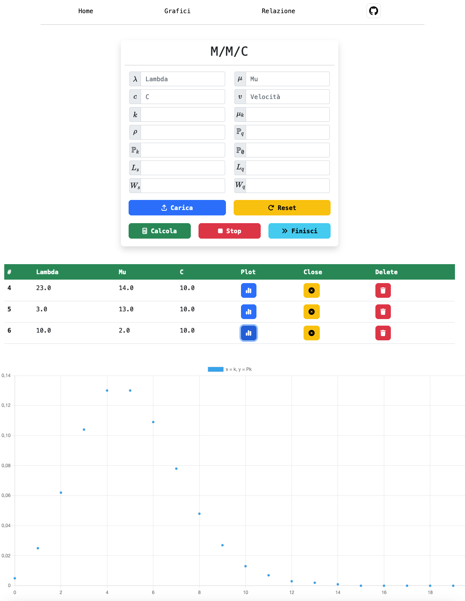

# progetto-reti



## Descrizione
L’obbiettivo formativo legato allo svolgimento di questo compito è quello di comprendere il comportamento del sistema a coda M/M/c.
La lettera c in questo sistema descrive il numero di servitori. Il tasso di servizio viene rappresentato da μ e descrive le utenze per ogni secondo [pkt/s]. L’ultimo dato noto viene descritto dalla lettera λ e rappresenta il tasso di arrivi per ogni secondo [pkt/s].

## Installazione
Clonazione della repository:
```console
$ git clone https://github.com/acuti03/progetto-reti.git
```

Installazione di python: https://www.python.org/downloads/

### MacOs:
#### Installazione di Homebrew:
```console
$ /bin/bash -c "$(curl -fsSL https://raw.githubusercontent.com/Homebrew/install/HEAD/install.sh)"
```

#### Installazione di PostgreSQL:
```console
$ brew install postgresql
```

#### Far partire il servizio di PostgreSQL:
```console
$ brew services start postgresql
```

#### Creazione del database:
1. Per prima cosa digitare:
```console
$ psql postgres 
```
per aprire il pannello di controllo di PostgreSQL.

2. Successivamente creare il databse chiamandolo: "gfg".
```SQL
$ CREATE DATABASE gfg;
```
3. Chiudere il pannello di PostgreSQL:
```console
$ \q
```
#### Verificare che pip sia installato con:
```console
$ pip --version
```
Se da errore consultare: https://phoenixnap.com/kb/install-pip-mac

#### Installazione di django:
```console
$ pip install django
```
#### Installazione del virtualenv:
```console
$ pip install virtualenv
```
#### Entrare dentro la cartella del progetto e digitare:
```console
$ virtualenv gfg
```
#### Installare il modulo "psycopg2":
```console
$ pip install psycopg2
```
#### Far partire il server:
```console
$ python3 manage.py runserver
```
Visitare il link:


### Windows:
Per installare PostgreSQL e fare il set-up visitare il link: https://www.prisma.io/dataguide/postgresql/setting-up-a-local-postgresql-database#setting-up-postgresql-on-windows.
Scegliere la porta ``8000``.

#### Creazione del database:
1. Per prima cosa digitare:
```console
$ psql
```
per aprire il pannello di controllo di PostgreSQL.

2. Successivamente creare il databse chiamandolo: "gfg".
```SQL
$ CREATE DATABASE gfg;
```
3. Chiudere il pannello di PostgreSQL:
```console
$ \q
```

#### Verificare che pip sia installato con:
```console
$ pip --version
```

In caso di errore consultare: https://www.geeksforgeeks.org/how-to-install-pip-on-windows/

#### Installazione di django:
```console
$ pip install django
```
#### Installazione del virtualenv:
```console
$ pip install virtualenv
```
#### Entrare dentro la cartella del progetto e digitare:
```console
$ virtualenv gfg
```
#### Installare il modulo "psycopg2":
```console
$ pip install psycopg2
```
#### Far partire il server:
```console
$ python3 manage.py runserver
```
Visitare il link:
